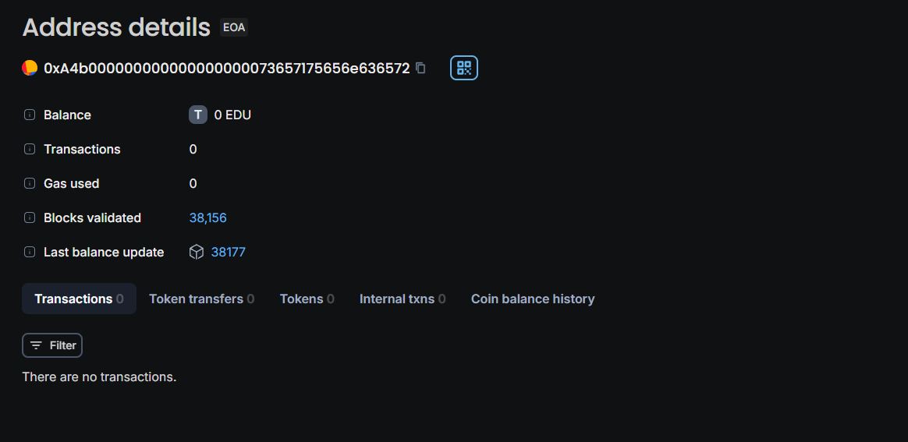

Here's a sample README file for the `ResearchPaper` Solidity smart contract:

---

# ResearchPaper Smart Contract


This smart contract, `ResearchPaper`, allows users to submit and verify research papers on the Ethereum blockchain. The contract ensures that each paper submission is unique by checking the title, author, and IPFS hash before adding the paper to the blockchain.

## Features

- **Paper Submission**: Users can submit a paper with a title, author, abstract, keywords, and an IPFS hash.
- **Duplicate Check**: The contract checks if a paper with the same title, author, and IPFS hash already exists before accepting a new submission.
- **Paper Verification**: The contract includes a boolean field for tracking whether a paper has been verified.
- **Paper Access**: Users can retrieve the details of any paper submitted to the blockchain using its unique ID.

## Contract Structure

### 1. **Paper Struct**
   - `title`: Title of the research paper.
   - `author`: Author of the research paper.
   - `abs`: Abstract of the research paper.
   - `keywords`: Keywords related to the research paper.
   - `ipfsHash`: The IPFS hash (CID) pointing to the paper's content stored off-chain.
   - `timestamp`: The block timestamp when the paper was submitted.
   - `verified`: A boolean indicating whether the paper has been verified.

### 2. **State Variables**
   - `papers`: A mapping from paper IDs (uint) to `Paper` structs, storing all submitted papers.
   - `paperCount`: A uint tracking the total number of papers submitted.

### 3. **Functions**
   - **`submitPaper`**: Submits a new paper to the blockchain. 
     - Parameters: `_title`, `_author`, `_abs`, `_keywords`, `_ipfsHash`.
     - The function checks if a paper with the same title, author, and IPFS hash already exists. If not, it increments the `paperCount` and stores the paper.
   
   - **`paperExists`**: Checks if a paper with the given title, author, and IPFS hash already exists in the blockchain.
     - Parameters: `_title`, `_author`, `_ipfsHash`.
     - Returns: `true` if a matching paper exists, otherwise `false`.
   
   - **`getPaper`**: Retrieves the details of a paper by its ID.
     - Parameters: `_id`.
     - Returns: The title, author, abstract, keywords, IPFS hash, timestamp, and verification status of the paper.

## Usage

### Deployment

To deploy the contract, you can use any Ethereum-compatible development environment like Remix, Truffle, or Hardhat.

1. **Compile the Contract**: Ensure your Solidity compiler version is set to `>=0.7.10`.
2. **Deploy the Contract**: Deploy the contract on your chosen Ethereum network (e.g., Ropsten, Rinkeby, or a local test network).

### Example Interaction

1. **Submit a Paper**:
    ```solidity
    contractInstance.submitPaper("Title", "Author", "Abstract", "Keywords", "IPFS_Hash");
    ```

2. **Check if a Paper Exists**:
    ```solidity
    bool exists = contractInstance.paperExists("Title", "Author", "IPFS_Hash");
    ```

3. **Retrieve a Paper's Details**:
    ```solidity
    (string memory title, string memory author, string memory abs, string memory keywords, string memory ipfsHash, uint timestamp, bool verified) = contractInstance.getPaper(1);
    ```

## Security Considerations

- **IPFS Storage**: The content of the papers is stored off-chain using IPFS. Ensure that the IPFS hash is correct and points to the intended content.
- **Verification**: The contract includes a `verified` boolean, which can be extended to allow a verification process by authorized entities.

## License

This project is licensed under the MIT License - see the [LICENSE](LICENSE) file for details.

---

This README provides a comprehensive guide to understanding, deploying, and using the `ResearchPaper` smart contract.


